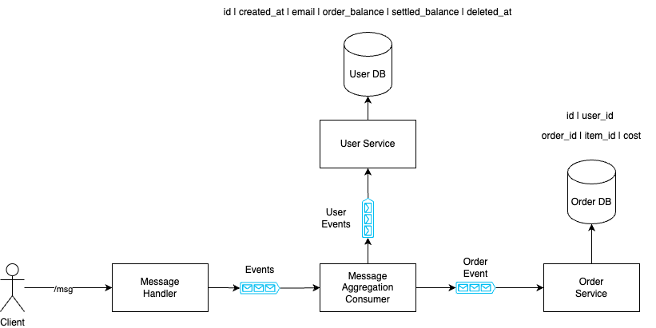

## Build:
```sh
./message_dispatcher/gradlew -p message_dispatcher clean build
cargo build --manifest-path message_consumer/Cargo.toml
```

## Run

### Start Docker

```sh
docker-compose -f docker/docker-compose.yaml up -d
```
### Start Dispatcher
```sh
./message_dispatcher/gradlew -p message_dispatcher run   
```
### Start Consumer
```sh
cargo run --manifest-path message_consumer/Cargo.toml
```

## Test

```sh
python3 test_suite/basic_test.py
python3 test_suite/user_partition_test.py
```

## Architecture (WIP)


